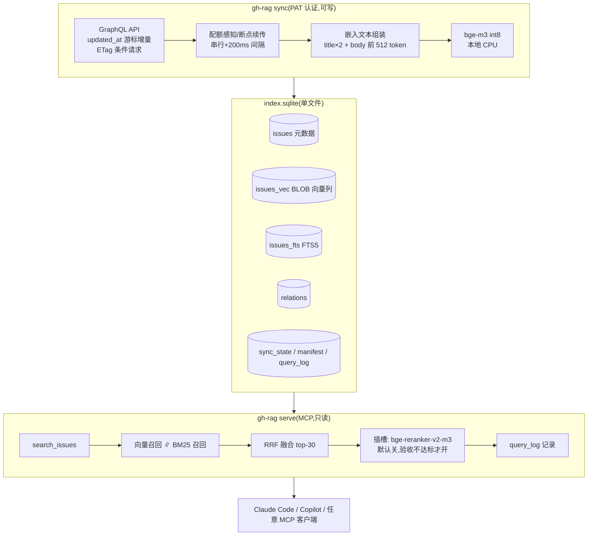

# github-rag 项目方案(v1.2 定稿)

> 2026-09-20(v1.2 增补 §3.8 CLI/MCP 契约;v1.1 增补两步法路线)。本文档收敛了全部调研、架构讨论与四份 GLM-5.3 独立评估的修正意见,是开工依据。
> 姊妹文档:`PROPOSAL.md`(评估输入版,含竞品调研细节)。

## 1. 一页纸摘要

**两个项目,一个引擎:**

- **项目 A「gh-rag」**:给多仓库维护者/开发者的 issue 语义记忆层。跨仓库语义检索 + agent 上下文包,MCP 形态供 Claude Code / Copilot 等消费。开源、不商业化、本地优先。
- **项目 B「bugcards」**:社区共建的生态级故障经验卡片库(markdown 仓库 + 程序化锚定字段 + 评审信任标记)。**冻结,A 验证通过后启动。**

**立项逻辑**:AI 时代 issue 爆炸是真实且加速的痛点;官方(Copilot 语义搜索已 GA、duplicate detection preview)覆盖了单仓库 + Copilot 订阅者;**我们的锚点是官方结构性不做的层:跨 org 聚合、私有数据自托管、任意 agent 的开放 MCP 消费、非热门项目的长尾维护者。**

**核心纪律**(来自评估的最大教训):
1. 验证对象是「agent 消费 context pack 是否可测量提升开发质量」,不是「自己爱不爱用」
2. kill criteria 先于开发设定
3. 功能面克制:所有火过的 RAG 项目都死于膨胀

## 2. 背景与定位

### 2.1 问题

AI 编码普及导致开源 issue 爆炸:数量(门槛消失)、重复(相似 prompt 产出趋同)、质量(幻觉性 bug 报告)、对话污染。issue 库本质是三份未被利用的资产:**用户声音、机构记忆、故障史**——当前仅关键词可查。

### 2.2 竞争格局结论(2026-09 调研)

| 对手 | 状态 | 与我们的错位 |
|---|---|---|
| GitHub 官方 | 语义 issue 搜索已 GA(2026-05,付费 Copilot 计划,热门开源维护者免费 Pro);duplicate detection preview;relates-to | 单仓库、绑 Copilot 生态、不做跨 org/自托管/开放 MCP |
| unsight.dev | 136★,Nuxt 负责人个人项目,embedding+聚类,索引 nuxt 系 | 自用溢出,无 MCP/agent 接口,分发受限 |
| 小项目群 | 2-12★,查重 Action / FAISS MCP / 分析脚本 | 无一个做完整 |
| VoC SaaS(Enterpret 类) | 商业成立 | 进不了私有数据场景 |

### 2.3 差异化定位(唯一可守的阵地)

```
跨 org 语义记忆 + 私有数据不出域 + 任意 agent 的 MCP 消费 + 白送的显式关系图(duplicate/sub-issue/linked PR)
```

## 3. 项目 A:MVP 完整设计

### 3.1 范围与非目标

**做:**

| 能力 | 说明 |
|---|---|
| 多仓库同步 | GraphQL 增量(updated_at 游标),全量 + lazy catch-up(TTL 10 分钟) |
| 语义索引 | bge-m3 本地 embedding,**向量存 BLOB 列** + FTS5,单文件 `index.sqlite`(跨语言兼容,见 3.8) |
| 混合检索 | 向量 + BM25 → RRF 融合 →(插槽)rerank |
| MCP 服务 | 3 个工具:`search_issues` / `get_issue_context` / `find_related` |
| 质量地基 | query_log 第一天埋点;duplicate 对评测集;RAGAS 集成 |
| 关系图存储 | `relations` 表存 API 白送的显式关系(MVP 只存不查,Phase 2 检索增强) |

**不做(MVP 非目标):**

聚类/晨报(定位已被评估否定)、自动查重/写操作、base+delta 分发、GitHub App/webhook、Web UI、Jira 适配、ACL、B 的抽取管道。

### 3.2 系统架构



### 3.3 数据 Schema(DDL 摘要)

```sql
CREATE TABLE issues (
  repo TEXT NOT NULL, number INTEGER NOT NULL,
  title TEXT, body TEXT, state TEXT, labels TEXT,  -- JSON array
  author TEXT, comments_count INTEGER,
  created_at TEXT, updated_at TEXT,
  embedded_text_hash TEXT,                          -- 内容变了才重嵌
  PRIMARY KEY (repo, number)
);
CREATE TABLE issues_vec (                            -- BLOB 存 float32/1024,应用层暴力扫描
  issue_id INTEGER PRIMARY KEY,
  embedding BLOB NOT NULL                             -- sqlite-vec(vec0)仅作可选加速,非依赖
);
CREATE VIRTUAL TABLE issues_fts USING fts5(
  title, body, content='', tokenize='porter unicode61'
);  -- external content 模式,rowid 对齐 issues
CREATE TABLE relations (
  repo TEXT, number INTEGER, kind TEXT,             -- dup-of / sub-of / references / linked-pr
  target_repo TEXT, target_number INTEGER,
  PRIMARY KEY (repo, number, kind, target_repo, target_number)
);
CREATE TABLE sync_state (
  repo TEXT PRIMARY KEY, cursor_updated_at TEXT, page_cursor TEXT,
  etag TEXT, last_sync_at TEXT
);
CREATE TABLE manifest (                             -- 环境钉死,一致性对账依据
  key TEXT PRIMARY KEY, value TEXT
);  -- bge_m3_version / quantization / sqlite_vec_version / schema_version
CREATE TABLE query_log (
  id INTEGER PRIMARY KEY, ts TEXT, tool TEXT, query TEXT,
  filters TEXT, results TEXT,                       -- 返回的 repo#number 列表
  follow_up TEXT                                    -- 后续是否 get_issue_context(点击信号)
);
```

写入规则:issue 变更 = 同一事务内 `DELETE`+`INSERT`;MCP server 只读,写操作全走 sync(绕开单写者锁)。**BLOB + 应用层扫描是刻意的跨语言设计**:vec0 表依赖各语言对 sqlite-vec 扩展的移植(Rust 经 rusqlite 可加载,但 Go 纯实现 modernc 无 loadable extension 机制读不了);BLOB 方案任何语言零障碍,且 Rust 手写 SIMD 扫描性能不低于 sqlite-vec 的 C 实现。

### 3.4 同步引擎与限流工程

| 措施 | 实现 |
|---|---|
| 认证 | PAT(5,000 请求/h / GraphQL 5,000 点/h);Phase 2 升级 GitHub App token(15,000/h)+ webhook |
| 用量核算 | 日常增量 ~12 点/h(0.1% 配额);1 万条全量 ~400 点;20 万条 ~8 千点,跨小时断点跑 |
| 断点续传 | sync_state 记游标 + 分页 cursor,中断续跑 |
| 配额感知 | 读 `x-ratelimit-remaining`,<200 则 sleep 到 reset |
| ETag 条件请求 | 304 不扣配额,轮询实际消耗趋近于零 |
| 二级限流规避 | 串行请求,翻页间 200ms;尊重 Retry-After |

### 3.5 检索管线与质量保证

**管线**:`title×2 + body512` 嵌入 → 向量召回 ∥ FTS5 召回(各 top-30)→ RRF 融合 →(可选)bge-reranker-v2-m3 int8(本地 CPU,50 候选亚秒级)→ top-5。**Rerank 默认关闭**,触发条件:top-5 垃圾率 >30%,或两段式点击率低。Agent 两段式设计本身就是 LLM-as-reranker 兜底。

**质量系统**(行业验证过的三件套,直接采纳):

1. **评测集**:抓目标仓库历史 duplicate 对(维护者亲口确认的 ground truth,自动脚本化)+ 20 条真实使用查询;接 **RAGAS** 算 context precision/recall,不自研指标
2. **点击日志**:两段式工具的「摘要→拉全文」行为 = 免费相关性标注,定期蒸馏进评测集
3. **回归门禁**:管线/参数改动跑评测集,指标倒退即拦截

**性能红线**:单实例 ≤10 万条(应用层暴力扫描 ~20-50ms);超限先 int8 量化,再考虑引擎替换。超限触发换 LanceDB,服务化触发换 Qdrant——`IssueStore` 窄接口保底。

### 3.6 MCP 工具签名

```
search_issues(query: str, repos?: str[], state?: open|closed|all,
              labels?: str[], top_k?: int = 5)
  → [{repo, number, title, score, snippet}]

get_issue_context(repo: str, number: int)
  → {issue 全文, labels, 相关 top-5 摘要, relations(dup/sub/linked-PR)}

find_related(repo: str, number: int, top_k?: int = 10)
  → [{repo, number, title, score}]
```

### 3.7 依赖与技术栈(两期)

**验证期(Phase 0–1.5,Python,不分发)**:核心依赖 ≤5:`sentence-transformers`(或 ONNX runtime)、`mcp`、`gql`(或 httpx 手写)、`typer`、`ragas`(评测)。自用阶段无分发摩擦,Python 的生态与速度全部兑现。

**发布期(Phase 2a 起,Rust 单二进制)**:`rusqlite`(bundled + FTS5)、`rmcp`(官方 Rust MCP SDK)、`ort` + `tokenizers`(ONNX 进程内推理,或 ollama sidecar 二选一)、`cynic`(GraphQL)、`clap`。GoReleaser 全平台单文件分发。**B 的抽取管道、评测脚本、CI 逻辑永久留在 Python 脚本域(`scripts/`,不发布)**——prompt 编排没有理由用编译语言。

模型文件统一本地管理,bge-m3 版本 + 量化方式写入 manifest。

### 3.8 CLI 与 MCP 契约(Phase 0 冻结,重构期不动)

**架构:一个内核两个壳。** CLI 与 MCP 调用同一个同步引擎与检索器,一份 query_log、一套检索参数(存 config.toml,不写死代码)。

```
gh-rag init / sync <repos...> / sync --all / sync --watch   # 同步族
gh-rag status / rebuild / doctor / eval                      # 管理(Phase 0 实现 status/rebuild/doctor)
gh-rag search "q" [--repo ...] [--state ...] [--labels ...] [-k]  # 人类直接查(与 agent 同一结果)
gh-rag issue <owner/repo>#N / related <owner/repo>#N         # context pack / 相似列表
gh-rag serve [--stdio|--http]                                # MCP server
```

| MCP 工具 | 签名 | agent 触发场景(描述文案即触发器) |
|---|---|---|
| `search_issues` | `(query, repos?, state?, labels?, top_k=5)` | 开发前查「是否有人提过 X」、找历史讨论 |
| `get_issue_context` | `(repo, number)` | 深入某条 issue:全文 + 相关 top-5 + relations |
| `find_related` | `(repo, number, top_k=10)` | 查重、扩展检索 |
| `list_repos` | `()` | 查询前自检已索引范围与新鲜度 |

Phase 0 最小集:`init` / `sync` / `search` / `serve` + 上述 4 工具。命令名/参数形状/工具签名自此刻冻结。

## 4. 验收与退出标准(先于开发设定)

**验收(MVP 完成的定义):**

1. 对 ≥2 个真实仓库连续自用 7 天
2. query_log 证明 agent 真实调用(非手动)
3. 20 条真实查询 top-5 命中抽查通过
4. 记录 ≥1 次「agent 因召回历史 issue 改变行为」

**kill criteria:**

- 上线 30 天 0 外部用户 → 归档或重新定位
- 3 名陌生多仓库维护者试用,7 天内全部弃用 → 假设证伪
- Phase 2 的启动条件 = 上述验收全过 + 外部使用者出现

## 5. 项目 B:二期设计(冻结,启动条件见上)

**形态**:markdown 卡片仓库,一 bug 一文件。frontmatter:`id/symptoms/root_cause/fix_pr/affected_versions/stack[]/source_issue/reviewed/reviewer` + 正文叙事。

**分片**:按技术类型 7-10 个一级目录(frontend/k8s-cloud/database/ai-ml/devops/mobile/lang-runtime),**物理分片管分发与重建,frontmatter 多值 stack 标签管检索归属**;索引用 SQLite 分片(MoE 式路由:stack 直路由 + 无栈广播扇出 RRF 合并),单片超 10 万条再换 LanceDB。

**生产管道**(复用 A 的同步/嵌入/检索资产):`label:bug 且有关联修复 PR` 入口过滤 → LLM 结构化抽取(「放弃」是合法输出)→ 双模型交叉验证 + 程序化锚定(版本/PR 字段从 diff/milestone 校验,不信 LLM 自由文本)→ `reviewed: false` 入库 → 社区 PR 审核翻 true。

**分发**:双通道——git clone 自建库(embedding 纯函数近似一致,环境哈希对账)/ CI 每次 merge 自动 schema 校验 + 按片重建索引 + 附 Release。

**法律**:仓库 LICENSE 只授权自产内容;他人 issue 内容以摘要 + 结构化元数据 + 溯源链接呈现。

**诚实预期**:全自动质量天花板 80-90 分;「AI 初稿 + 社区轻量审核」是冷启动唯一可行路径,审核供给是 B 最大的结构性风险——这也是 B 被冻结的原因。

## 6. 路线图(两步法)

**语言策略:Python 快速验证 → 思路确认后 Rust 重构为单二进制发布。** 分界线 = 「自用 → 分发给陌生人」:验证期只有自己用,Python 分发摩擦不存在;重构发生在发布动机最明确的时刻。重构成本被三个结构性事实压到接近零:核心管线 <1000 行(翻译不是再设计)、索引可重建(重跑 sync 即得,无数据迁移)、验证期真正产出语言无关(评测集/参数/query_log,Rust 直接继承)。

| 阶段 | 内容 | 量级 |
|---|---|---|
| **Phase 0 脏版验证** | 手动导出 1 个活跃仓库 issue → 100 行脚本(bge-m3+BLOB+最简 MCP)→ Claude Code 接入,验证「检索质量体感」 | 1-2 天 |
| **Phase 1 MVP(Python)** | 本文档第 3 节全部 | 1-2 周业余 |
| **Phase 1.5 验收** | 第 4 节四条 + 评测集建立 | 1 周(并行自用) |
| **Phase 2a Rust 重构** | **发布工程,仅当验收通过且出现发布需求**:按 §3.7 发布期栈翻译,单二进制 + GoReleaser | 1-2 周 |
| **Phase 2b 功能扩展** | GitHub App + webhook 实时增量;base+delta 分发;图扩展检索(relations 白送数据);聚类主题视图;PR 语义校验;`[rerank]` 视验收决定 | 视 Phase 1.5 数据 |
| **Phase 3** | B 启动:抽取管道(Python 脚本域)+ bugcards 仓库 + CI 索引分发 | 视外部验证 |

### 6.1 两步法成立的第一天纪律

| 纪律 | 防的失败模式 |
|---|---|
| 向量存 BLOB 列,不用 vec0 专属特性 | 语言锁死:Rust 读不了 sqlite-vec 私有格式 |
| MCP 工具签名 Phase 0 冻结,重构期不许动 | 对外契约漂移,客户端感知切换 |
| 评测集/检索参数(RRF k、截断长度、过滤规则)存独立配置文件 | 验证产出散落代码里,重构时丢失 |
| 重构触发条件写死:验收通过 + 发布需求出现 | 过早重构(验证未完烧时间)或永不重构(烂尾成 Python 万年形态) |

## 7. 风险登记册(浓缩四份评估)

| 风险 | 等级 | 对策(已内置) |
|---|---|---|
| 官方功能挤压 | 高 | 锚定结构性层(2.3);不做与官方重叠的查重/晨报 |
| 自用验证盲区 | 高 | kill criteria 前置;外部用户验证为 Phase 2 门槛 |
| 单人维护负担 | 高 | 单引擎(SQLite)两项目复用;依赖 ≤5;功能面克制 |
| 聚类质量无底洞 | 中 | MVP 不做聚类,Phase 2 才碰 |
| B 信任两难(草稿可检索则污染,不可检索则空库) | 中 | 冻结 B;锚定字段程序化;reviewed 过滤 |
| embedding 一致性 | 中 | 环境哈希进 manifest,指纹不符拒绝合并 |
| 法律(他人内容授权) | 低 | B 只存摘要 + 溯源;A 纯私有索引无分发问题 |

## 8. 附录:RAG 生态调研的采纳/拒绝清单

**采纳**:RAGAS 评估(3.5)、reranker 默认插槽(3.5)、角色化模型配置(Embedder/Reranker 接口)、低足迹可选装(3.7)、示例驱动文档(Phase 1.5 后补)、存储窄接口(3.5)、双级检索思想(BM25=low-level / 向量=high-level 的查询路由显式化)。

**拒绝**:LLM 知识图谱抽取(真图免费)、深度文档解析(issue 非 PDF)、chunking 策略(issue 天然自边界)、WebUI/工作流/多模态(消费端是 agent)、LangChain/LlamaIndex 依赖(管线五步,框架是负资产)。
